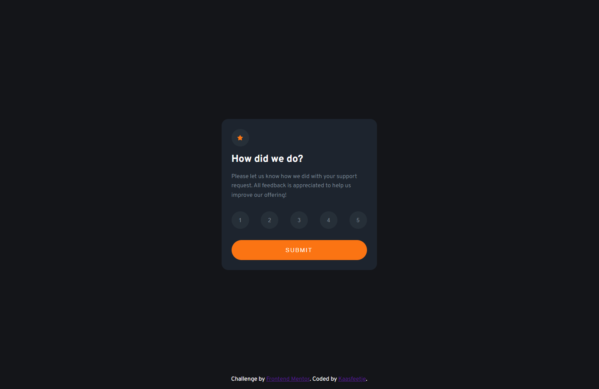
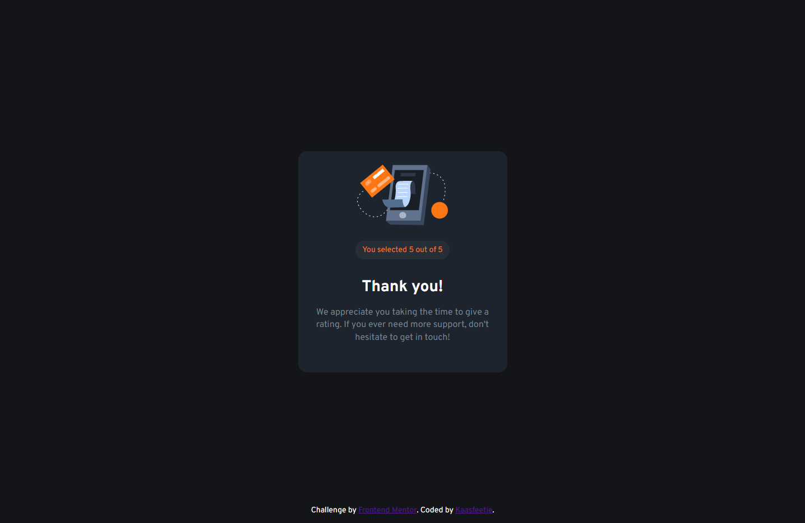
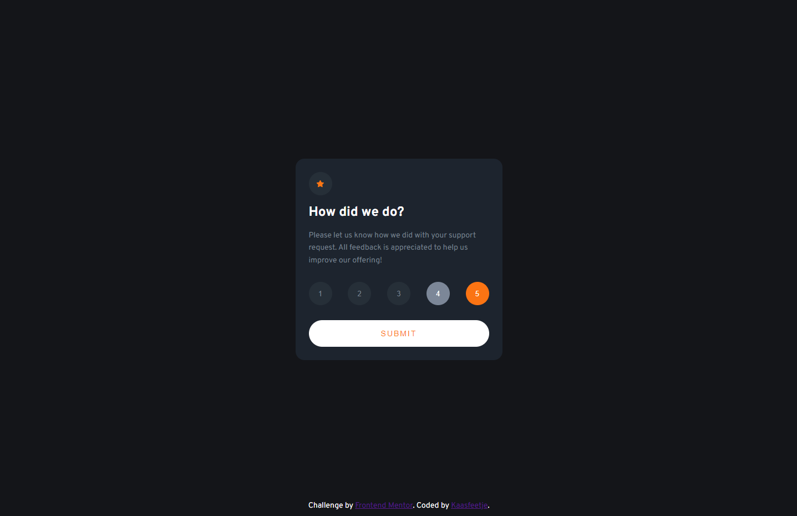
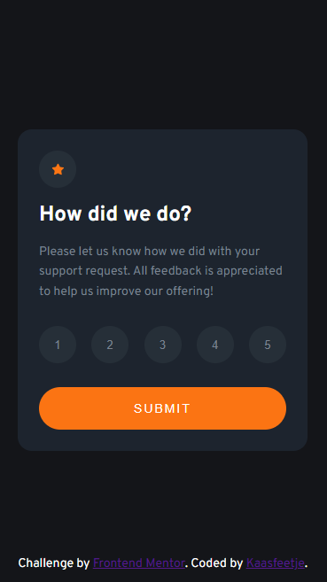
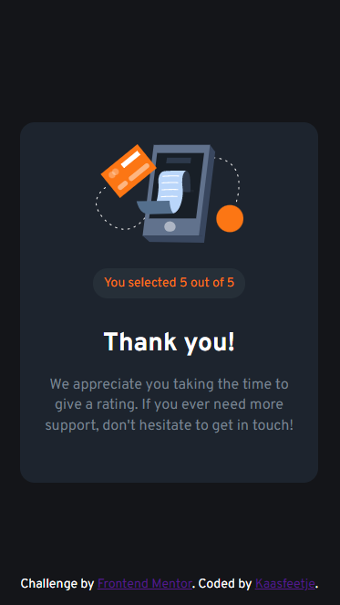

# Frontend Mentor - Interactive rating component solution

This is a solution to the [Interactive rating component challenge on Frontend Mentor](https://www.frontendmentor.io/challenges/interactive-rating-component-koxpeBUmI). Frontend Mentor challenges help you improve your coding skills by building realistic projects.

## Table of contents

-   [Overview](#overview)
    -   [The challenge](#the-challenge)
    -   [Screenshot](#screenshot)
    -   [Links](#links)
-   [My process](#my-process)
    -   [Built with](#built-with)
-   [Author](#author)

## Overview

### The challenge

Users should be able to:

-   View the optimal layout for the app depending on their device's screen size
-   See hover states for all interactive elements on the page
-   Select and submit a number rating
-   See the "Thank you" card state after submitting a rating

### Screenshot

### Links

-   Solution URL: [Github](https://github.com/Kaasfeetje/Frontend-Mentor-Interactive-Rating-Component)
-   Live Site URL: [Site](https://your-live-site-url.com)

## My process

First I got the card to be centered by having main be width:100%; height:100%; display:flex; justify-content:center; align-items:center; Then I tried getting the colors, since the colors from the style guide did not match up. I put the icons in seperate React elements. Then I made the Rating Button and the star icon. Then I sized the text accordingly. Finally I made the submit button.

For the thank you card, I reused most of the css for the rating card, but just centered everything and passed the rating down.

### Built with

-   React
-   CSS
-   Mobile First

## Author

-   Github - [Kaasfeetje](https://github.com/Kaasfeetje)
-   Frontend Mentor - [@Kaasfeetje](https://www.frontendmentor.io/profile/Kaasfeetje)
-   Twitter - [@veldhuisMax](https://twitter.com/VeldhuisMax)
